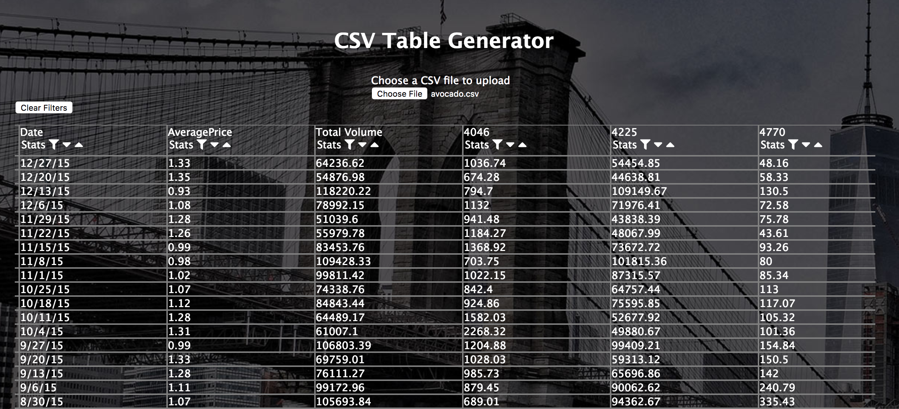

# CSV Table Generator

Do you have a CSV file that you dream of seeing become a beautiful, organized table that you can sort and filter? Well then you have come to the right place. This CSV Table Generator allows anyone to take an unstructured CSV and view it in easy-to-read columns. On top of that, users can sort data AND filter rows. Have fun seeing your data become more than just comma separated values.

Visit the website here: [CSV Table Generator](https://robertoconnor.io/csv-app)

## Technologies
This app uses React and JavaScript to generate components, manage their state, and handle the logic of sorting and filtering rows.
